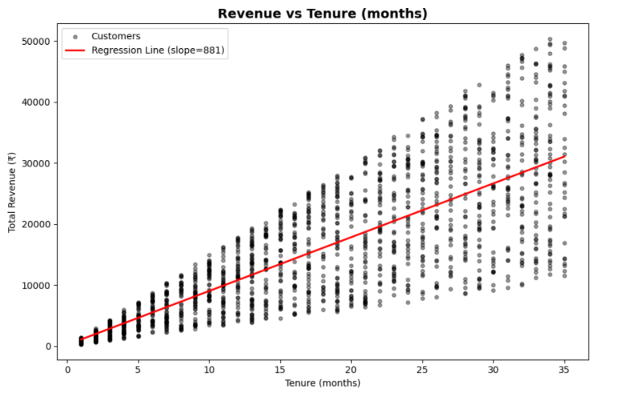
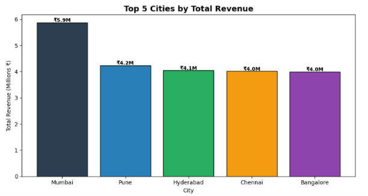
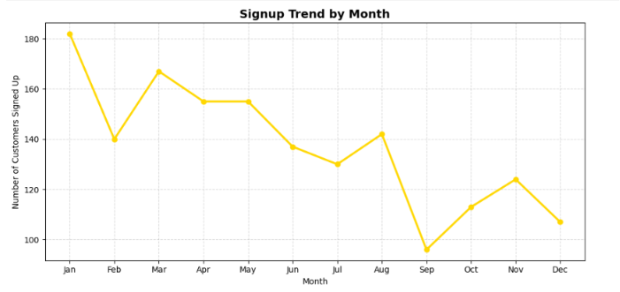
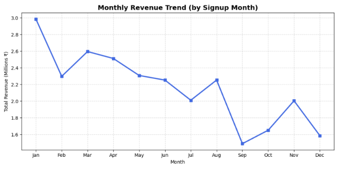
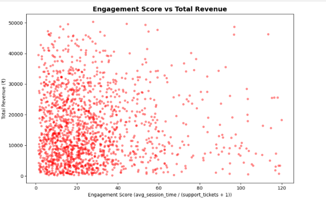
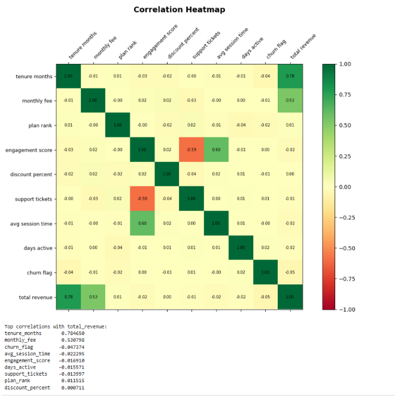

<div align="center">

# 📊 End-to-End Customer Analytics & Revenue Forecasting

### Transforming Customer Data into Business Insights using Python & Machine Learning

[](https://python.org)
[](https://pandas.pydata.org/)
[](https://scikit-learn.org/)
[](https://github.com/yogesh-021-code)

</div>

---

# 📊 Project Highlights

### Dataset Summary

| Metric | Value |
|---------|---------|
| Total Records | 2,000 Customers |
| Features Analyzed | 15 |
| Engineered Features | 14 |
| Visualizations Created | 14+ |
| Machine Learning Models | 1 |
| Target Variable | Total Revenue |
| Model Accuracy (R²) | 91.8% |

---

# 📈 Key Business Findings

### Revenue Drivers

- Customer tenure showed the strongest relationship with revenue (**Correlation = 0.78**).
- Monthly subscription fee was the second most influential revenue factor (**Correlation = 0.53**).
- Premium and Standard plans generated the highest average customer value.
- Long-term customers consistently produced significantly higher revenue.

### Customer Behavior Insights

- Customers with higher engagement scores demonstrated stronger revenue contribution.
- Support ticket frequency negatively impacted engagement levels.
- High-tenure customers were less likely to churn and generated higher lifetime value.

### Geographic Insights

- Mumbai emerged as the highest revenue-generating city (**₹5.9M+ revenue**).
- Pune, Hyderabad, Chennai, and Bangalore were identified as other major revenue contributors.

### Business Trends

- Customer acquisition peaked during January and March.
- Revenue trends indicated seasonal fluctuations across signup months.
- September recorded the lowest revenue contribution among all months.

---

# 🤖 Machine Learning Results

### Linear Regression Performance

| Metric | Value |
|----------|----------|
| R² Score | 0.918 |
| Variance Explained | 91.8% |
| Model Type | Linear Regression |
| Prediction Objective | Customer Revenue Forecasting |

### Model Interpretation

The Linear Regression model successfully captured approximately **91.8% of total revenue variation**, indicating strong predictive capability for future customer revenue forecasting and business planning.

---

# 💼 Business Recommendations

### Customer Retention

- Focus retention campaigns on customers with low tenure.
- Develop loyalty programs for long-term subscribers.

### Revenue Growth

- Promote upgrades from Basic to Premium plans.
- Target high-value customer segments identified through engagement scoring.

### Marketing Optimization

- Invest more in acquisition channels generating high-value customers.
- Improve conversion strategies during low-performing months.

### Customer Experience

- Reduce support ticket frequency through proactive customer support.
- Increase customer engagement through personalized experiences.
# 📂 Dataset Overview

| Category | Features |
|----------|-----------|
| Customer Information | Age, Gender, City |
| Subscription Data | Plan Type, Monthly Fee, Tenure |
| Usage Metrics | Session Time, Support Tickets |
| Marketing Data | Channel, Discounts |
| Target Variable | Total Revenue |

---

# ⚙️ Feature Engineering

Created several business-focused features:

- Customer Tenure Years
- Revenue Per Month
- Churn Flag
- High Value Customer Flag
- Revenue Category
- Age Group
- Support Intensity
- Engagement Score
- Plan Rank
- Session Usage Category

### Engagement Score Formula

```python
engagement_score = avg_session_time / (support_tickets + 1)
```

---

# 📈 Key Visualizations

## Revenue by Subscription Plan


---

## Revenue vs Customer Tenure



---

## Top Revenue Generating Cities



---

## Customer Signup Trend



---

## Monthly Revenue Trend



---

## Engagement Score vs Revenue



---

## Correlation Analysis



### Top Revenue Drivers

| Feature | Correlation |
|----------|------------|
| Tenure Months | 0.78 |
| Monthly Fee | 0.53 |
| Engagement Score | Positive Impact |
| Churn Flag | Negative Impact |

---

# 🤖 Machine Learning Model

### Model Used

🔹 Linear Regression

### Workflow

```text
Data Collection
      ↓
Data Cleaning
      ↓
Feature Engineering
      ↓
EDA
      ↓
Train-Test Split
      ↓
Linear Regression
      ↓
Revenue Prediction
```

---

## Model Performance


### Performance Metrics

| Metric | Score |
|----------|----------|
| R² Score | 0.918 |
| Revenue Prediction Accuracy | 91.8% |

### Key Insight

The model successfully explains approximately **91.8% of customer revenue variation**, making it highly effective for revenue forecasting.

---

# 🛠️ Tech Stack

- Python
- Pandas
- NumPy
- Matplotlib
- Seaborn
- Scikit-Learn
- Jupyter Notebook

---

# 📁 Project Structure

```text
Customer-Analytics-Revenue-Forecasting/
│
├── images/
├── subscription_revenue_prediction.ipynb
├── subscription_data.csv
├── README.md
├── requirements.txt
└── .gitignore
```

---

# 🚀 Future Improvements

- Random Forest Regression
- XGBoost Regression
- Churn Prediction Model
- Power BI Dashboard
- Customer Lifetime Value Prediction

---

# 📬 Connect With Me

<p align="center">

<a href="mailto:yogeshdhruwy@gmail.com">

</a>

<a href="https://www.linkedin.com/in/yogesh-dhruw-031ba8321/">

</a>

<a href="https://github.com/yogesh-021-code">

</a>

</p>

---

<div align="center">

⭐ If you found this project useful, please consider giving it a star!

</div>